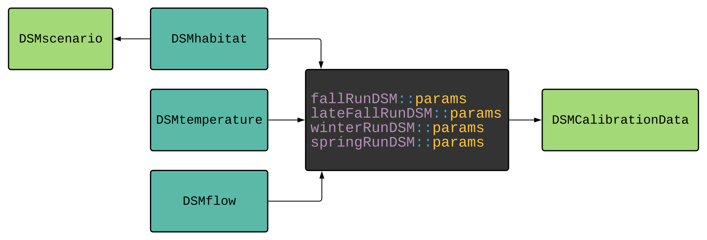

```{r, include = FALSE}
```

## Frequently Asked Questions

### Repository Structure

#### Q: Where is all the code for the model within the repository directory structure?

A: The **R/** directory contains all model code. The filenames describe the type of functions within the file. For example, survival.R includes all of the survival sub-model functions for the model.

#### Q: Where is the code defining the lifecycle mechanics?

A: The functions within the file **R/model.R** defines the lifecycle mechanics. For example, for fallRunDSM, the function `fall_run_model()` in **R/model.R** defines the lifecycle mechanics of fall-run Chinooks.This function calls submodels to route, rear, grow, and apply survival to fish. These submodels are all found in the R directory.

#### Q: Where are the details for model/sub-model parameters, calibration analysis, and sensitivity analysis?

A: The calibration, sensitivity analysis, and reference materials are found on the model documentation website, under the following links:

-   [Fall-run documentation site](https://cvpia-osc.github.io/fallRunDSM)
-   [Spting-run documentation site](https://cvpia-osc.github.io/springRunDSM)
-   [Winter-run documentation site](https://cvpia-osc.github.io/winterRunDSM)
-   [Late-fall-run documentation site](https://cvpia-osc.github.io/lateFallRunDSM) 

The reference tab includes the details for model parameters, sub-models, datasets, and helper functions. The Articles tab contains the details regarding calibration and sensitivity analysis.

#### Q: What is the code repository's analysis folder?

A: The analysis folder contains scripts for running sensitivity analysis and scenarios. These scripts operate in parallel and are a good starting point for further analysis.

#### Q: What is the code repository's calibration folder?

A: The calibration folder contains scripts for running calibration on DSM models and helper scripts for updating the cached data within the model.

#### Q: What is the code repository's man folder?

A: The man folder contains the manual that generates the model/sub-model documentation.

#### Q: Where can I see code examples of how to run the model?

A: Each model has a website where the [front page](https://cvpia-osc.github.io/fallRunDSM/index.html) provides the model code. The code provided in the link is an example of running the fall-run model with SIT-defined scenario 1. For more information regarding the run model, check out the run_model [documentation](https://cvpia-osc.github.io/fallRunDSM/reference/fall_run_model.html).

#### Q: How are all the repositories related to each other on CVPIA Open Science Collaborative's GitHub?

A: The models (fallRunDSM, lateFallRunDSM, winterRunDSM, and springRunDSM) use data objects from DSMflow, DSMtemperature, and DSMhabitat packages as model inputs. Data objects for each run are cached from these data packages and available under the params data object. To access stream temperature specific to fallRunDSM one would use the following: `fallRunDSM::params$avg_temp`.

The package DSMscenario creates scenarios to show how Chinook salmon populations change depending on potential restoration actions. More information on scenario development can be found [here](https://cvpia-osc.github.io/DSMscenario/).

{width=100%}

### Model Mechanics

#### Q: What is the overall structure of the model in R?

A: The overall structure of the model starts by defining global variables to be used as input and storage. It then steps into an annual loop (either 5 or 20 years depending on the model mode). Within this annual loop a second loop representing months is defined in which juvenile fish grow and move. Upon closing of a single month iteration, fish are either sent to the ocean or remain in rearing for use in the next month's dynamics. Upon closing of all month iterations, returning adults are calculated and used in the next annual iteration. The model finishes running once the annual iteration is complete and outputs are calculated.

#### Q: What is the difference between calibrate, seed, and simulate mode in the `fall_run_model()` function?

A: In **seed mode** the model runs for five years and returns a matrix of seeding adults to be used in the simulation mode of the model. In **simulation mode** the model runs for 20 years and uses adults obtained from running the model in seed mode and returns a data object with the following outputs: spawners, juvenile biomass, and proportion natural. In **calibration mode** the model runs for 20 years and uses known adults as input from the DSMCalibration package and returns a matrix of adults to be used in calculating a loss value for use in the calibration process.

#### Q: Why do some function argument names begin with **'.'** and others **'..'**?

A: Sub-model coefficients are function arguments to facilitate sensitivity analysis. We identify these coefficients by beginning the argument names with a **'.'** or **'..'**. Coefficient argument names that start with **'..'** have been derived from calibration. Coefficient argument names that start with **'.'** were derived from meta-analysis, literature, or expert opinion.

#### Q: What does the stochastic argument to the model do?

A: The model will run using random variation submodels when stochastic is true. While all inputs are constant, running the model with stochastic set to true will result in different outputs each time. While all inputs are constant, running the model with stochastic set to false will result in the same output each time.

#### Q: Where can I find the code that defines fish routing onto the floodplain, in-channel, or out-migrating?

A: The code that defines where fish are routed (floodplain, in-channel, or migrating) is defined within the monthly dynamics for loop. This for loop exists within the annual iterations and can be easily found by locating the following code (for fall-run for example):

```{r, eval = FALSE}
for (month in 1:8)
```

Each model version, (fall, winter, and spring) will vary on the months used for iteration but the structure remains the same.

#### Q: Where are survival probabilities calculated?

A: [R/survival.R](https://github.com/CVPIA-OSC/fallRunDSM/blob/v2.0/R/survival.R) contains the definition for survival sub-models. All survival functions start with "surv\_", followed by the specific survival sub-model name. For example, the function signature for juvenile rearing survival is `surv_juv_rear`. R/survival.R also contains two helper functions `get_rearing_survival` and `get_migratory_survival` these call the individual survival submodels to increase readability in the main model file.

### Model Inputs

#### Q: How can I find details about temperature modeling for a given watershed?

A: The DSMtemperature repository contains the details for temperature modeling for a given watershed. The [documentation](https://cvpia-osc.github.io/DSMtemperature/index.html) for this repository includes details regarding the inputs for the temperature model. Each temperature-related data set for each watershed is found in the [reference](https://cvpia-osc.github.io/DSMtemperature/reference/index.html) section.

#### Q: How can I find details about habitat modeling for a given watershed?

A: The DSMhabitat repository contains the details for habitat modeling for a given watershed. The [documentation](https://cvpia-osc.github.io/DSMhabitat/index.html) for this repository contains details regarding habitat functions, habitat datasets, miscellaneous datasets, and model input data. The details for a given watershed are found under [habitat datasets](https://cvpia-osc.github.io/DSMhabitat/reference/habitat_data.html#modeling-details-for-streams).

#### Q: How can I find details about flow modeling for a given watershed?

A: The DSMflow repository contains details for flow modeling for a given watershed. The [documentation](https://cvpia-osc.github.io/DSMflow/) for this repository includes details regarding the model used to generate hydrologic inputs for the project. The details for each flow-related data set are found in the [reference](https://cvpia-osc.github.io/DSMflow/reference/index.html) section.

### Miscellaneous

#### Q: How do I know I have the most up to date version of the model and data packages installed? What if I want to use an older version?

A: Version control is handled through GitHub. To install the latest versions of the model and any other CVPIA package use the following code:

```{r, eval = FALSE}
remotes::install_github("cvpia-osc/fallRunDSM")
```

To install a specific version of the model, first identify the branch associated with the release version (these use the tag v1.0, v1.1 and so on), then modify the `install_github` function call as follows

```{r, eval = FALSE}
remotes::install_github("cvpia-osc/fallRunDSM@v1.0")
```

#### Q: Can I use or modify the model for my own purposes?

A: The SIT decision support models are intended to be transparent and open source. Others are welcome to download, use, and modify the model for their own purposes though users assume any risk of using the model for other purposes or not including the data the model is designed for. Any distribution, communication, or publication of results from using or modifying the SIT models should be accompanied by the following text: 

"These analyses were conducted by [insert user name] based on the code developed for a specific set of decision support models developed and maintained on behalf of the CVPIA     Science Integration Team (fallRunDSM v2.0.0, springRunDSM v2.0.0, and winterRunDSM v2.0.0). Any modifications to the model code or data (such as model inputs, parameters, or calibration) are solely the responsibility of the user. These code modifications and model outputs were not reviewed or interpreted by the Science Integration Team." 

The SIT models are designed to address the SIT’s structured decision making objectives (see the [Near-term Restoration Strategy](https://cvpia-documents.s3-us-west-1.amazonaws.com/CVPIA_Near-term-Restoration-Strategy_FY21-FY25_FINAL.pdf)) and the SIT has worked to reduce the uncertainties that are most relevant to those objectives. The SIT uses the models to predict the effects of restoration actions on the natural production and juvenile biomass of Chinook salmon. The restoration actions the SIT has defined are to restore spawning habitat, restore perennially inundated juvenile habitat, restore seasonally inundated juvenile habitat, or improve survival (as a proxy for decrease or screen water diversions). 

The following example would be using the SIT Chinook salmon models as designed and intended: defining and exploring candidate restoration strategies (using the [DSMscenario package](https://cvpia-osc.github.io/DSMscenario/)) that are some combination of the existing restoration actions and using the model’s existing inputs, parameters, and calibration.   

The SIT model is calibrated to the specific model inputs. Changing model inputs requires re-calibrating the model and the result is actually a different model and the outputs are not directly comparable to outputs of the SIT version of the model. Altering the model code to consider restoration actions other than those listed above would also represent a different model.  

In addition, the extensive sensitivity analyses conducted on the SIT models have identified the parameters the models are particularly sensitive to. These include numerous demographic parameters (juvenile survival rates, juvenile growth rates, adult survival, reproduction, juvenile territory size), habitat availability estimates, water temperature, days cross-channel gate closed, probability of nest scour, hatchery returns, adult return timing, and stream flows. This means that changes in the estimates for these parameters will result in significant changes in the model outputs. The NTRS identifies salmon demographic parameters and habitat estimates as key information needs to improve the Chinook salmon models. 

The model outputs for the different candidate restoration strategies are intended to be considered relative to one another. When the SIT developed the 13 candidate restoration strategies plus a no action strategy for the Near-term Restoration Strategy, they compared the model output across those strategies to assess which combination of actions and locations led to the highest predicted increases of juvenile biomass and natural production compared to other combinations of actions and locations.   

It is important to note that the interpretation of the model output is a single element to the SIT’s overall structured decision making process and the development of recommended priorities for restoration actions and information needs. SIT members developed criteria for identifying priorities, which include connectivity, spatial diversity, natural productivity, supported by model outputs, and the runs benefiting. The combination of the model output along with the other criteria is what resulted in the list of priorities in the Near-term Restoration Strategy.  

#### Q: I found something within the code or inputs that seems like an error, how can I notify model developers?

A: When you find n error, you can open an [issue on GitHub](https://github.com/CVhttps:/github.com/CVPIA-OSC/fallRunDSM/issuesPIA-OSC/fallRusection%20of%20the%20issue%20please%20descrinDSM/issues). In the comments section of the issue please describe the problem in detail, and if possible paste code that reproduces this error. Maintainers will be notified of this issue and communicate with you on the issue tracker page. 

#### Q: I have an idea on how to improve model mechanics or source data, how can I propose a change?
A: The SIT has a process and template for proposing changes to the models. Please contact the Science Coordinator for more information.


